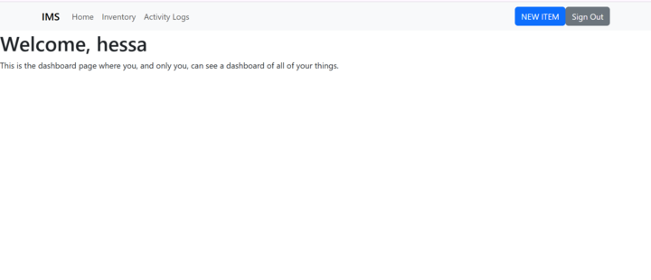
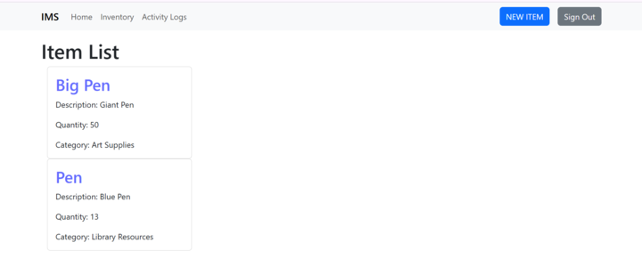
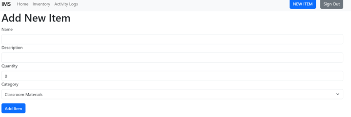
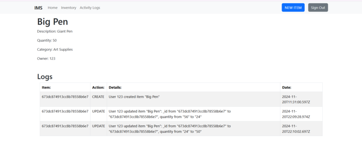
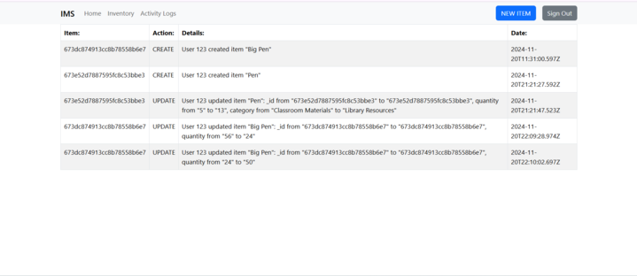

# Inventory Management System (IMS)

## .env setup

Create an .env file and add the following before starting the server

**Development:**
``VITE_BACKEND_URL="http://localhost:3000"``

## Live Demo 🚀
You can view the deployed website [here!](https://inventory-management-system-frontend-psi.vercel.app//)

## User Stories
- As a User, I want to sign up or sign in before viewing and managing the inventory to ensure that any changes in the inventory can be tracked.
- As a User, I want to create, read, update, and delete inventory items, so that I can efficiently manage school resources like textbooks, lab equipment, and supplies.
- As a User, I want to ensure that only authorized users can modify inventory data, so that unauthorized changes are prevented and data integrity is maintained.
- As a User, I want all secret keys to be handled securely in the back end, so that sensitive information is not exposed and the application remains secure.
- As a User, I want to access the inventory system online from anywhere, so that inventory management can be convenient and I can reduce paperwork.
- As a User, I want an activity log that records all actions, so that I can have complete accountability for changes and efficiently manage resources.
- As a User, I want to manage the availability of classroom materials, so that I do not run out of critical supplies like textbooks and whiteboard markers.

## Pseudo Code
### Define Models
- DEFINE User
    - id: ObjectId
    - username: String (required)
    - hashedPassword: String (required)
- DEFINE Item
  - id: ObjectId
  - name: String (required)
  - description: String
  - quantity: Number (required)
  - category: String (required)
- DEFINE ActivityLog
  - id: ObjectId
  - user: ObjectId (ref to User) (required)
  - item: ObjectId (ref to Item) (required)
  - action: String (required) // CREATE, READ, UPDATE, DELETE
  - timestamp: Date (required)
  - details: String

### Authentication & Authorization
- FUNCTION signUp(username, password)
  - hashedPassword = hash(password)
  - CREATE new User with username and hashedPassword
- FUNCTION signIn(username, password)
  - FIND User by username
  - IF User exists AND password matches hashedPassword THEN
    - GENERATE JWT token
    - RETURN token
  - ELSE
    - RETURN error "Invalid credentials"
- FUNCTION isAuthorized(token)
  - DECODE JWT token
  - RETURN true IF token valid AND user exists
### CRUD Operations for Inventory Items
- FUNCTION createItem(token, itemDetails)
  - IF isAuthorized(token) THEN
    - CREATE new Item with itemDetails
    - LOG action to ActivityLog (user, item, action = "CREATE")
  - ELSE
    - RETURN error "Unauthorized access"
- FUNCTION readItems(token)
  - IF isAuthorized(token) THEN
    - RETURN all Items
  - ELSE
    - RETURN error "Unauthorized access"
- FUNCTION updateItem(token, itemId, updatedDetails)
  - IF isAuthorized(token) THEN
    - FIND Item by itemId
    - IF Item exists THEN
      - UPDATE Item with updatedDetails
      - LOG action to ActivityLog (user, item, action = "UPDATE")
    - ELSE
      - RETURN error "Item not found"
  - ELSE
    - RETURN error "Unauthorized access"
- FUNCTION deleteItem(token, itemId)
  - IF isAuthorized(token) THEN
    - FIND Item by itemId
    - IF Item exists THEN
      - DELETE Item
      - LOG action to ActivityLog (user, item, action = "DELETE")
    - ELSE
      - RETURN error "Item not found"
  - ELSE
    - RETURN error "Unauthorized access"
### View Activity Logs
- FUNCTION viewActivityLogs(token)
  - IF isAuthorized(token) THEN
    - RETURN all ActivityLogs
  - ELSE
    - RETURN error "Unauthorized access"

## Routes
### Item routes
| Action | Route                                   | HTTP Verb |
|--------|-----------------------------------------|-----------|
| Index  | `/items`                                | GET       |
| New    | `/items/new`                            | GET       |
| Create | `/items`                                | POST      |
| Show   | `/items/:itemsId`                       | GET       |
| Edit   | `/items/:itemsId/edit`                  | GET       |
| Update | `/items/:itemsId`                       | PUT       |
| Delete | `/items/:itemsId`                       | DELETE    |

### ActivityLog routes
| Action | Route                                   | HTTP Verb |
|--------|-----------------------------------------|-----------|
| Index  | `/logs`                                 | GET       |
| Index  | `/logs/:itemId`                         | GET       |

## Wireframe
### Landing Page

### Dashboard Page

### Listing Page

### Form Page

### Show Page
   
### Activity Log Page

## Technologies
- HTML
- Javascript
- CSS
- Bootstrap
- React
- JSON Web Token (JWT)
- Express
- MongoDB
- Node
- Mongoose
- Vite
- Restful API
- Heroku
- Vercel

## Future Work
- Create classrooms and assign materials
- Add user role-based authentication 
- Mobile Support
